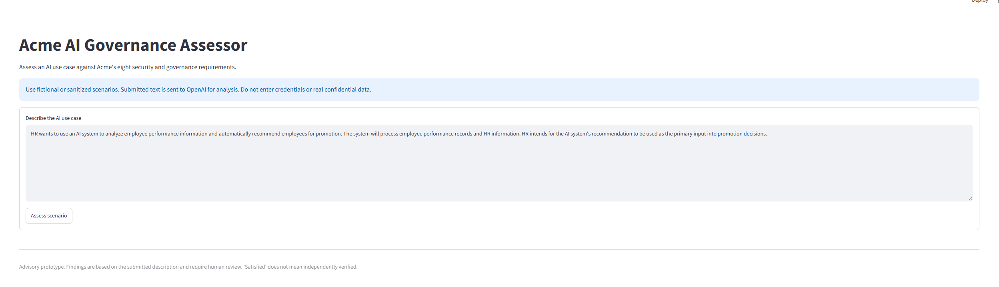
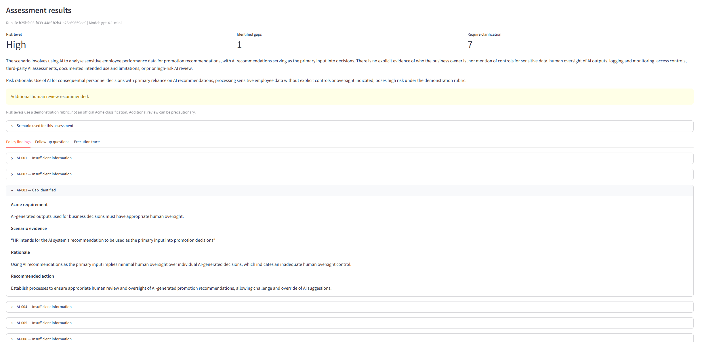
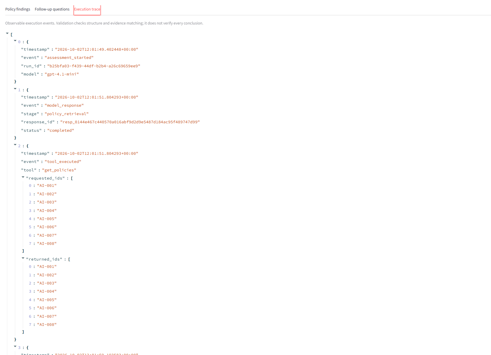

# Acme AI Security & Compliance Assessor

A small AI-powered application that assesses proposed AI use cases against
Acme Financial Services' eight security and governance requirements.

The application produces structured findings, scenario evidence, recommended
actions, follow-up questions, and an observable execution trace.

## Features

- Assess custom security and AI governance scenarios.
- Evaluate all eight Acme requirements, AI-001 through AI-008.
- Distinguish confirmed control gaps from missing information.
- Link findings to policy requirements and scenario excerpts.
- Recommend actions and identify questions requiring human clarification.
- Display policy retrieval, validation, and correction events.
- Download the assessment and execution trace as JSON.

## Screenshots

### Assessment overview



### Policy finding



### Agent execution trace




## Technology

- Python
- Streamlit for the interface
- OpenAI Responses API with `gpt-4.1-mini`
- Pydantic for structured output and validation
- pytest for automated tests


## Using the application

1. Enter a fictional or sanitized AI use case.
2. Describe its purpose, data, hosting, ownership, human oversight, and controls.
3. Select **Assess scenario**.
4. Review the risk rating, policy findings, and follow-up questions.
5. Inspect the execution trace.
6. Download the JSON report if needed.


## Project structure

```text
.
├── app.py                    # Streamlit interface and JSON export
├── agent.py                  # Tool orchestration and application validation
├── prompts.py                # Assessment instructions and demo risk rubric
├── schemas.py                # Structured assessment models
├── policy_tools.py           # Validated, read-only policy retrieval
├── demo.py                   # Manual API integration check
├── data/
│   └── policies.json         # Acme policy reference
├── tests/
│   ├── test_policy_tools.py
│   └── test_evidence.py
├── docs/
│   └── screenshots/
├── .env.example
├── .gitignore
└── requirements.txt
```